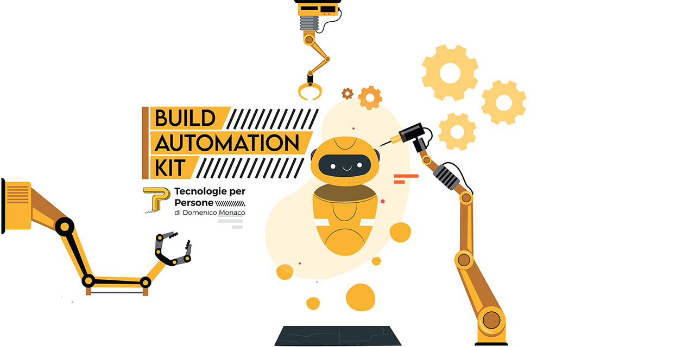

# Build Automation KIT

### Requirements

* node (16.15.1 as default) <https://nodejs.org/it/> 
* npm <https://www.npmjs.com/>
* nvm <https://github.com/nvm-sh/nvm>
* git <https://git-scm.com/>

### Advanced Usage

Clone the source files of the theme and navigate into the theme's root directory. Run `npm install`. You can view the `package.json` file to see which scripts are included.

#### List of Users
List of users need to be stored into *users.csv* and need contain id, nome, cognome and gitusername columns at least

#### Configuration
Configuration is stored into *.env* file

#### Pay Attention

**This software is an automation kit, so has some automation also critical such as "hard reset" and "deleting folders" and "discarding changes".** 

Therefore pay attention to use it, is possible that some bugs can overwrite your work! Is seggesting using it into "controlled space" to prevent disaseter in others folder.

#### Usage
          
              //////
      ___oOOo( ͡° ͜ ͡° )oOOo____[BAK IS BACK: BUILD AUTOMATION KIT] __________[GNU GPL v3]

      bak <command>

      Comandi:
        bak loop-update [-f filename]             Hard reset of user repo folder,
        [--notopen]                               discarding changes and pull changes.
                                                  If not exist it try to be cloned
        bak loop-reinit [-f filename]             Deleting user repo folder, and
        [--notopen]                               re-clone it. If not exist it cloned
                                                  also

      Opzioni:
            --version  Mostra il numero di versione                         [booleano]
        -f, --file     csv of user    [stringa] [richiesto] [predefinito: "users.csv"]
            --notopen  no open browser                 [booleano] [predefinito: false]
        -r, --repo     name of repo, default was taken from .env
                      [stringa] [richiesto] [predefinito: "laravel-model-controller"]
        -h, --help     Mostra la schermata di aiuto                         [booleano]

      for more information, find the documentation at https://tecnologieperpersone.it

## Authors and License
Copyright © 2022 [Tecnologie per Persone di Domenico Monaco](https://www.tecnologieperpersone.it) 

Released under [GPL v3 License LICENSE.md](LICENSE)

### Developed by 

#### Developed for collaboration "Class 65 - Boolean SRL"

